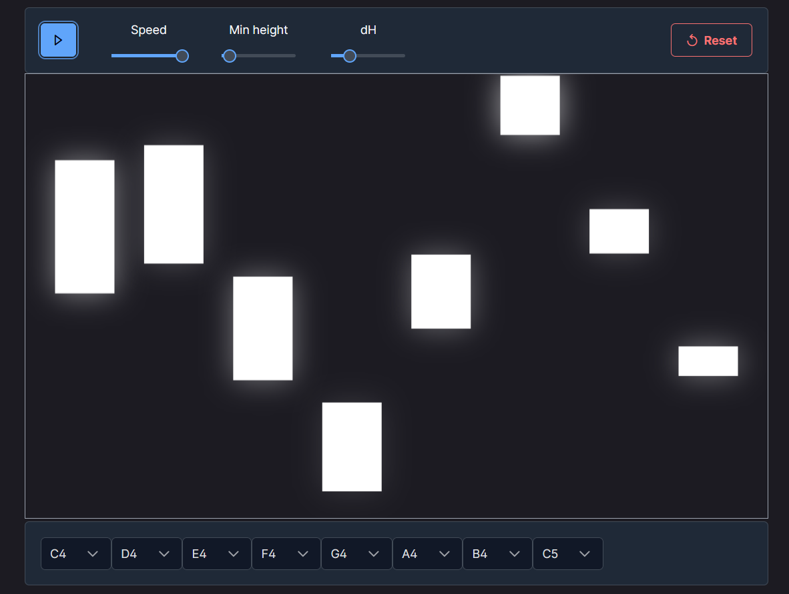

# AngularMusic

[Demo](https://angular-music-simulation.web.app/)

## About the project

This idea was taken from the YouTube channel [LucidDreams](https://www.youtube.com/@LucidRhythms). The author has his special secret software, so I decided to make something similiar.

## Built with

`Angular` and `PrimeNG`

## Getting started

1. Clone the repo
2. Install NPM packages `npm install`
3. Run `npm run start` or `ng serve`

## Usage

On control panel you have few controllers:
- **Play/Pause button**
- **Speed slider**
- **Min Height slider** (the height of the most right block)
- **dH slider** (the difference between block heights)

The best effect is achieved at slow speed and little blocks😄

## Contribution

If you have any ideas how to improve this thing, feel free to make a PR. I'm a beginner programmer, so I'll be glad to receive any feedback.
